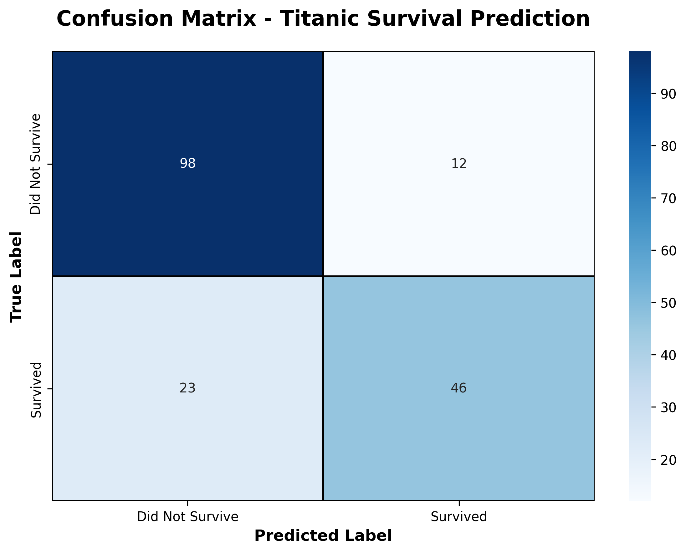
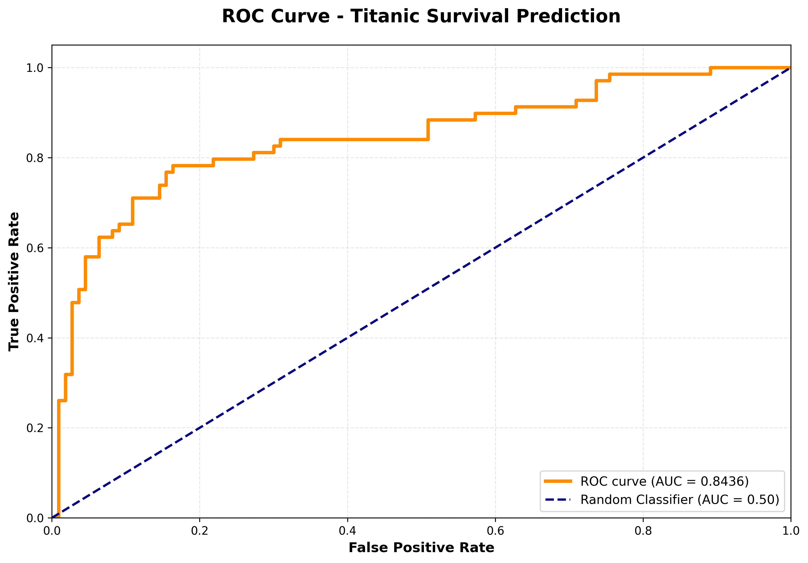

# Titanic Survival Prediction

Task 7 for my AI/ML internship at Elevate Labs. Built a logistic regression model to predict who survived the Titanic disaster.

## What I Did

Used the famous Titanic dataset to predict passenger survival based on things like age, gender, ticket class, etc.

The dataset had 891 passengers with features like:
- Class (1st, 2nd, 3rd)
- Sex
- Age  
- Fare paid
- Where they boarded

## Steps I Followed

**Data Cleaning:**
- Some ages were missing so I filled them with the median age
- A couple embarked locations were missing, filled with the most common port
- Dropped the deck column because too much data was missing

**Preparing the Data:**
- Converted male/female to numbers (1/0)
- Used one-hot encoding for the embarked ports
- Scaled all the numeric features so they're on the same level

**Building the Model:**
- Split data into 80% training and 20% testing
- Trained a logistic regression model
- Got around 80% accuracy which is pretty good

## Results

The model works decently. Women and first-class passengers had way better survival chances, which makes sense historically.





## Running the Code

You need these libraries:
```
pip install pandas numpy seaborn matplotlib scikit-learn
```

Then just run:
```
python titanic_complete.py
```

It'll print out the accuracy and other metrics, plus save the two images above.

## What I Learned

- How to handle missing data in real datasets
- Encoding categorical variables 
- Training and evaluating classification models
- Understanding precision, recall, and ROC curves
- Data preprocessing is actually most of the work!

---

Made by Aditya Balaji Bhise for Elevate Labs internship
